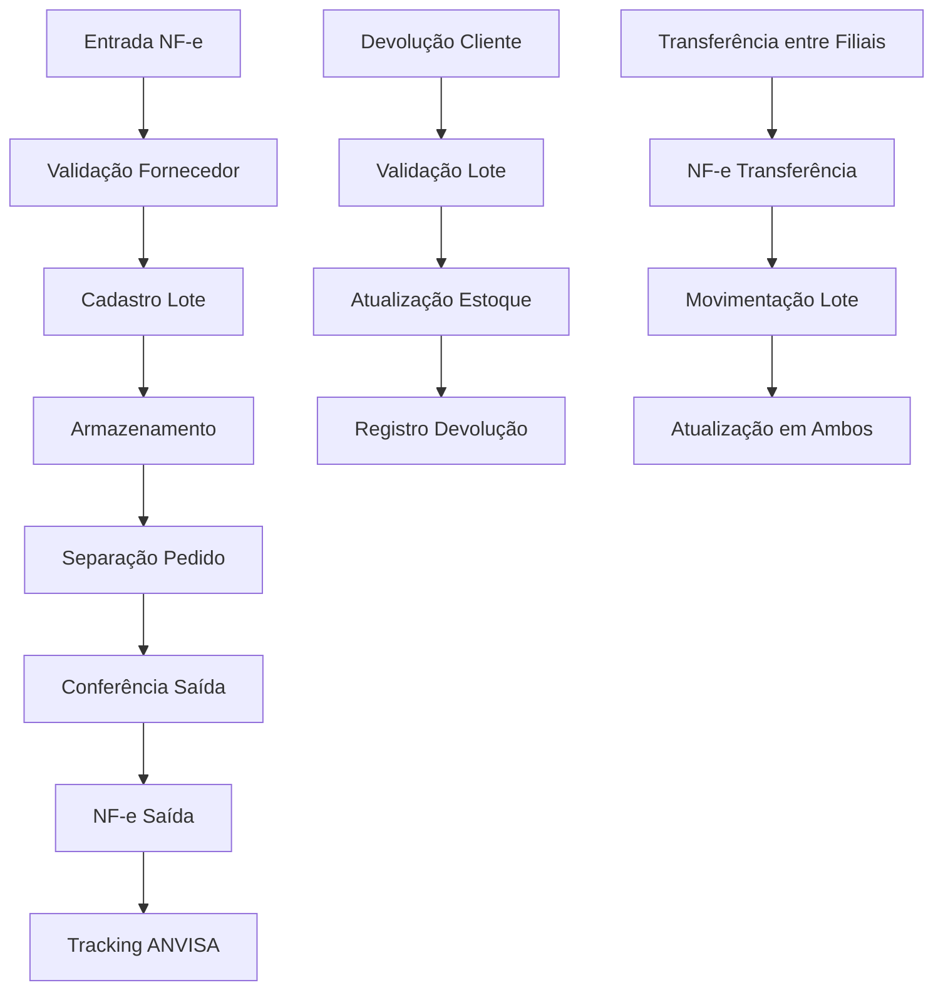

## 1. Visão Geral do Produto

Sistema de gestão para distribuidoras de medicamentos com conformidade regulatória completa à RDC 430/2020 e Guia 33 da ANVISA. O sistema garante rastreabilidade, segurança e compliance em todas as operações de distribuição farmacêutica.

**Objetivos principais:**
- Atender 100% dos requisitos da RDC 430 e Guia 33
- Fornecer multitenancy com isolamento completo de dados
- Garantir rastreabilidade de lotes e controle de validades
- Integrar com APIs governamentais (ANVISA, Receita Federal)
- Emitir notas fiscais eletrônicas e documentos fiscais
- Gerenciar planos de assinatura e permissões granulares

**Valor de mercado:** Solução essencial para distribuidoras de medicamentos que precisam de compliance regulatório e gestão eficiente de operações.

## 2. Recursos Principais

### 2.1 Papéis de Usuário

| Papel | Método de Registro | Permissões Principais |
|-------|-------------------|----------------------|
| Administrador Master | Convite direto da empresa | Acesso total ao sistema, configuração de tenants, gestão de planos |
| Administrador Tenant | Cadastro pelo Master | Gestão completa do tenant, usuários, configurações |
| Gerente de Operações | Cadastro pelo Admin Tenant | Gestão de estoque, compras, vendas, relatórios |
| Farmacêutico Responsável | Cadastro com validação de CRF | Aprovação de vendas, controle de medicamentos controlados |
| Operador de Estoque | Cadastro pelo Admin Tenant | Movimentação de estoque, conferência de notas |
| Vendedor | Cadastro pelo Admin Tenant | Emissão de pedidos, consulta de clientes e produtos |
| Auditor | Cadastro especial | Acesso apenas a logs e auditorias, sem modificação |

### 2.2 Módulos de Funcionalidades

O sistema de distribuidora de medicamentos consiste nos seguintes módulos principais:

1. **Dashboard Gerencial**: Visão geral da operação, KPIs, alertas regulatórios
2. **Gestão de Estoque**: Controle de lotes, validades, armazenamento, separação por tipos
3. **Compras e Fornecedores**: Cadastro, avaliação, notas fiscais de entrada
4. **Vendas e Clientes**: Pedidos, notas fiscais de saída, controle de receitas
5. **Medicamentos Controlados**: Gestão especializada com conformidade à Portaria 344
6. **Rastreabilidade**: Tracking completo de lotes desde entrada até saída
7. **Auditoria e Logs**: Registro detalhado de todas as operações
8. **Documentos Fiscais**: Emissão de NF-e, CT-e, MDF-e integrados
9. **Compliance ANVISA**: Relatórios obrigatórios, integração com sistemas governamentais
10. **Gestão de Usuários**: Controle de acessos, permissões, histórico de ações
11. **Configurações**: Parâmetros do sistema, integrações, backup
12. **Planos e Assinaturas**: Gestão de tenants, cobrança, limites por plano

### 2.3 Detalhamento de Funcionalidades por Página

| Nome da Página | Módulo | Descrição das Funcionalidades |
|----------------|---------|-------------------------------|
| Dashboard | Visão Geral | Exibir KPIs principais (vendas, estoque, alertas), gráficos de tendências, notificações de compliance, alertas de validade e estoque mínimo |
| Gestão de Estoque | Estoque | Listar produtos com filtros por lote, validade, fornecedor; movimentação de entrada/saída; ajustes de inventário; controle de temperatura; localização no armazém |
| Cadastro de Produtos | Estoque | Registrar medicamentos com dados completos (DCB, DCI, laboratório), classificação de risco, armazenamento especial, prazo de validade padrão |
| Nota Fiscal Entrada | Compras | Lançar NF de entrada, conferência de itens, vinculação a pedidos, validação de fornecedor habilitado, geração de lançamento contábil |
| Nota Fiscal Saída | Vendas | Emitir NF-e com dados do cliente, itens vendidos, lotes utilizados, validades, retenção de impostos, integração com Sefaz |
| Pedido de Vendas | Vendas | Criar pedidos com seleção de clientes, produtos, lotes, validades, aplicação de políticas comerciais, geração de picking list |
| Clientes | Cadastros | Gerenciar clientes (farmacias, hospitais, drogarias), documentação exigida (licenças), formas de pagamento, limites de crédito, histórico de compras |
| Fornecedores | Cadastros | Cadastrar fornecedores com validação de habilitação ANVISA, documentação, avaliação de desempenho, histórico de compras |
| Medicamentos Controlados | Controle Especial | Gestão de estoque com controle de validade de receitas, registro de prescrições, limites por receita, controle de devoluções |
| Rastreabilidade | Rastreamento | Consultar movimentação completa de lotes (entrada, saída, devoluções), relatórios de tracking, exportação para ANVISA |
| Auditoria | Compliance | Visualizar logs detalhados de operações, filtros por usuário, data, tipo de operação, exportação de relatórios para auditoria |
| Relatórios ANVISA | Compliance | Gerar relatórios obrigatórios (movimentação de medicamentos, controlados, produtos vencidos), envio automático para sistemas governamentais |
| Usuários | Gestão de Acesso | Criar e gerenciar usuários, definir permissões por módulo, controle de senhas, histórico de acessos, bloqueio automático |
| Configurações do Sistema | Administração | Configurar parâmetros gerais, integrações fiscais, backups automáticos, políticas de segurança, templates de documentos |
| Gestão de Tenants | Multitenancy | Criar novos tenants, definir limites por plano, configurar isolamento de dados, monitorar uso de recursos |
| Planos e Cobrança | Assinaturas | Definir planos com limites de usuários, produtos, transações, gerenciar assinaturas, faturamento, histórico de pagamentos |

## 3. Fluxos de Processo Principais

### 3.1 Fluxo de Compra e Entrada de Mercadorias
1. Fornecedor envia nota fiscal eletrônica
2. Sistema valida habilitação do fornecedor na ANVISA
3. Recebimento físico com conferência de quantidades e lotes
4. Cadastro/atualização de produtos no estoque
5. Geração de etiquetas de identificação com códigos de barras
6. Armazenamento conforme classificação (temperatura, tipo)
7. Atualização automática do estoque e geração de lançamentos

### 3.2 Fluxo de Venda e Saída de Mercadorias
1. Cliente realiza pedido (com validação de documentação)
2. Sistema verifica disponibilidade de estoque e validade
3. Separação de produtos com controle de lotes (FEFO - First Expired, First Out)
4. Conferência e embalagem
5. Emissão de nota fiscal eletrônica
6. Geração de documentos de transporte (CT-e quando necessário)
7. Atualização do estoque e registro de saída

### 3.3 Fluxo de Rastreabilidade

## 4. Design da Interface do Usuário

### 4.1 Estilo de Design
- **Cores principais**: Azul farmacêutico (#1E40AF), Verde saúde (#059669), Alertas vermelho (#DC2626)
- **Cores secundárias**: Cinza neutro (#6B7280), Fundo claro (#F9FAFB)
- **Estilo de botões**: Arredondados com sombra sutil, hover com transição suave
- **Fontes**: Inter para textos, Roboto Mono para códigos/lotes
- **Tamanhos de fonte**: 14px corpo, 16px cabeçalhos, 12px labels
- **Layout**: Baseado em cards com grid responsivo, navegação lateral fixa
- **Ícones**: Estilo line icons, preferência por Feather Icons ou Heroicons

### 4.2 Design por Página

| Página | Módulo | Elementos de UI |
|--------|---------|-----------------|
| Dashboard | Principal | Cards com KPIs coloridos, gráficos de linha/barras, tabela de alertas com badges coloridos, botões de ação rápida |
| Estoque | Gestão | Tabela com filtros avançados, cards de produtos com fotos, badges de validade (verde/amarelo/vermelho), modal de detalhes do lote |
| Notas Fiscais | Fiscal | Formulário em steps, preview da NF-e, upload de XML, validação em tempo real, botão de envio com confirmação |
| Rastreabilidade | Tracking | Timeline visual do lote, mapa de calor de movimentação, exportação com ícone de download |
| Relatórios | Compliance | Filtros por período, seleção de colunas, preview antes de gerar, progress bar durante geração |

### 4.3 Responsividade
- **Desktop-first**: Otimizado para telas 1366x768 e superiores
- **Mobile-adaptativo**: Layout adaptável para tablets (768px+) com menu hambúrguer
- **Touch optimization**: Botões maiores (44px+) em dispositivos touch, gestos de swipe para aprovações
- **Print-friendly**: Versões imprimíveis de relatórios e notas fiscais

## 5. Requisitos Regulatórios Específicos

### 5.1 RDC 430/2020 - Boas Práticas de Distribuição
- **Rastreabilidade**: Registro completo de movimentação de cada lote
- **Controle de Validade**: Alertas automáticos de produtos próximos ao vencimento
- **Condições de Armazenamento**: Controle de temperatura e umidade por tipo de medicamento
- **Qualificação de Fornecedores**: Sistema de avaliação periódica com documentação
- **Devoluções**: Procedimento documentado com análise de causas
- **Recalls**: Sistema de comunicação rápida com clientes e ANVISA

### 5.2 Guia 33 da ANVISA - Medicamentos Controlados
- **Prescrições**: Validação de receitas com prazo de validade
- **Quotas**: Controle de limites por substância controlada
- **Registro de Vendas**: Sistema específico para medicamentos da Portaria 344
- **Relatórios**: Envio obrigatório mensal à ANVISA
- **Segurança**: Acesso restrito apenas a farmacêuticos habilitados

## 6. Requisitos de Multitenancy

### 6.1 Isolamento de Dados
- **Database-per-tenant**: Cada tenant possui seu próprio banco de dados PostgreSQL isolado
- **Criptografia**: Todos os dados sensíveis criptografados com chaves únicas por tenant
- **Backup isolado**: Backups separados e independentes por tenant
- **Restore granular**: Capacidade de restore apenas de dados específicos do tenant

### 6.2 Planos de Assinatura
| Plano | Usuários | Produtos | Transações/Mês | Preço |
|-------|----------|----------|-----------------|--------|
| Starter | Até 3 | Até 1.000 | 500 | R$ 299/mês |
| Professional | Até 10 | Até 10.000 | 5.000 | R$ 799/mês |
| Enterprise | Ilimitado | Ilimitado | Ilimitado | R$ 2.499/mês |
| Custom | Sob demanda | Sob demanda | Sob demanda | Negociado |

### 6.3 Limites e Quotas
- **Armazenamento**: 10GB (Starter), 50GB (Professional), 200GB (Enterprise)
- **API calls**: Rate limiting por plano (100/500/ilimitado por minuto)
- **Relatórios**: Quantidade e frequência limitadas por plano
- **Integrações**: Número de integrações simultâneas por plano

## 7. Requisitos de Auditoria e Rastreabilidade

### 7.1 Registro de Auditoria
- **Log completo**: Toda operação gera registro com usuário, timestamp, IP, dados alterados
- **Imutabilidade**: Logs não podem ser alterados ou excluídos (WORM - Write Once Read Many)
- **Retenção**: Mínimo 5 anos conforme legislação fiscal e sanitária
- **Exportação**: Capacidade de exportar logs em formatos padronizados (CSV, XML, JSON)

### 7.2 Rastreabilidade de Lotes
- **Código único**: Cada lote recebe identificador único no sistema
- **Tracking completo**: Desde entrada até saída final, incluindo transferências
- **Associações**: Vínculo entre lotes de entrada e saída (FIFO/FEFO)
- **Devoluções**: Rastreamento de produtos devolvidos e seus destinos

### 7.3 Conformidade Legal
- **LGPD**: Consentimento de usuários, direito ao esquecimento (exceto dados fiscais)
- **SPED Fiscal**: Integração com sistema governamental de escrituração fiscal
- **Bloco K**: Controle de inventário para SPED Fiscal
- **eSocial**: Envio de informações trabalhistas quando aplicável

## 8. Requisitos de Backup e Recuperação

### 8.1 Estratégia de Backup
- **Backup automático**: Diário às 02:00 AM, retenção de 30 dias
- **Backup incremental**: Cada 6 horas para dados críticos
- **Backup mensal**: Retido por 12 meses para compliance
- **Backup anual**: Retido por 7 anos para obrigações fiscais

### 8.2 Recuperação de Desastres
- **RTO (Recovery Time Objective)**: Máximo 4 horas para restauração completa
- **RPO (Recovery Point Objective)**: Máximo 1 hora de perda de dados
- **Restore granular**: Capacidade de restaurar apenas dados específicos
- **Validação automática**: Teste de integridade após restore

### 8.3 Monitoramento e Alertas
- **Health checks**: Monitoramento contínuo de disponibilidade
- **Alertas proativos**: Notificação antes de problemas críticos
- **Status page**: Página pública de status do sistema
- **SLA**: 99.9% de uptime garantido com compensação por falhas

## 9. Requisitos de Emissão de Nota Fiscal Eletrônica

### 9.1 NF-e (Nota Fiscal Eletrônica)
- **Emissão integrada**: Geração automática a partir do pedido
- **Validação XML**: Conformidade com schema da Sefaz
- **Contingência**: Sistema offline com emissão posterior quando Sefaz indisponível
- **Cancelamento**: Processo controlado com justificativa e aprovações
- **Inutilização**: Controle de numeração quando necessário

### 9.2 CT-e (Conhecimento de Transporte Eletrônico)
- **Transportadoras**: Cadastro com documentação completa
- **Romaneio**: Geração automática de ordens de coleta
- **Rastreamento**: Integração com sistemas de rastreamento
- **MDF-e**: Manifesto eletrônico para cargas compartilhadas

### 9.3 Integração Fiscal
- **SPED Fiscal**: Geração de arquivos mensais automaticamente
- **Sintegra**: Exportação para sistema estadual de informações
- **GIA**: Guia de informação e apuração do ICMS
- **DCTF**: Declaração de contribuições federais

## 10. Requisitos de Integração com APIs da ANVISA

### 10.1 SNGPC (Sistema Nacional de Gerenciamento de Produtos Controlados)
- **Envio automático**: Transmissão diária de movimentação de controlados
- **Validação**: Verificação de receitas e quotas antes da venda
- **Protocolo**: Armazenamento de protocolos de recebimento
- **Retransmissão**: Capacidade de reenvio em caso de falha

### 10.2 SNCM (Sistema Nacional de Controle de Medicamentos)
- **Tracking**: Envio de informações de rastreabilidade
- **Lotes**: Notificação de problemas com lotes específicos
- **Recalls**: Comunicação rápida de recalls e suspensões
- **Relatórios**: Dados agregados para monitoramento epidemiológico

### 10.3 Outras Integrações Governamentais
- **Receita Federal**: Consulta de CNPJ e CPF via API
- **Sintegra**: Validação de inscrição estadual
- **CND**: Certidão negativa de débitos
- **Licenciamento**: Verificação de licenças sanitárias estaduais/municipais

## 11. Casos de Uso Principais

### 11.1 UC001 - Realizar Venda de Medicamento Controlado
**Ator**: Vendedor + Farmacêutico Responsável
**Pré-condições**: Cliente cadastrado com documentação válida, receita digital válida
**Fluxo principal**:
1. Vendedor cria pedido selecionando cliente e produtos
2. Sistema valida disponibilidade de estoque e quotas do cliente
3. Farmacêutico revisa e aprova a venda
4. Sistema gera NF-e e registra no SNGPC
5. Impressão de etiquetas e documentos
6. Atualização de estoque e quotas

### 11.2 UC002 - Gerenciar Devolução de Produto Vencido
**Ator**: Operador de Estoque + Gerente
**Pré-condições**: Produto com validade vencida identificado
**Fluxo principal**:
1. Sistema gera alerta de produto vencido
2. Operador cria documento de devolução
3. Gerente aprova a devolução
4. Sistema gera NF-e de devolução para fornecedor
5. Atualização de estoque e registro de motivo
6. Geração de relatório para ANVISA quando necessário

### 11.3 UC003 - Emitir Relatório de Rastreabilidade
**Ator**: Auditor ou Fiscal
**Pré-condições**: Lote a ser rastreado identificado
**Fluxo principal**:
1. Usuário informa número do lote ou produto
2. Sistema busca toda movimentação do lote
3. Gera relatório com timeline completo
4. Inclui todos os documentos relacionados
5. Exportação em formato PDF ou XML
6. Envio para autoridades quando solicitado

### 11.4 UC004 - Realizar Auditoria Interna
**Ator**: Auditor Interno
**Pré-condições**: Período de auditoria definido
**Fluxo principal**:
1. Auditor seleciona período e módulos a auditar
2. Sistema gera amostras aleatórias de transações
3. Auditor revisa logs e documentos
4. Sistema identifica discrepâncias ou irregularidades
5. Geração de relatório de auditoria
6. Plano de ação corretiva quando necessário

### 11.5 UC005 - Configurar Novo Tenant
**Ator**: Administrador Master
**Pré-condições**: Novo cliente aprovado e plano definido
**Fluxo principal**:
1. Master cria novo tenant com dados da empresa
2. Configura plano e limites do tenant
3. Cria database isolado e usuário admin
4. Configura integrações fiscais por estado
5. Realiza setup inicial de parâmetros
6. Envio de credenciais e documentação

## 12. Requisitos de Performance e Escalabilidade

### 12.1 Performance
- **Tempo de resposta**: < 2 segundos para consultas simples, < 5 segundos para relatórios
- **Throughput**: Suportar 1000 transações por segundo durante pico
- **Concorrência**: Sistema multiusuário com locking otimista
- **Cache**: Implementar cache distribuído para consultas frequentes

### 12.2 Escalabilidade
- **Horizontal**: Capacidade de adicionar novos servidores automaticamente
- **Vertical**: Suporte a aumento de recursos sem downtime
- **Database sharding**: Particionamento de dados por tenant/ano
- **CDN**: Distribuição de conteúdo estático global

### 12.3 Monitoramento
- **APM**: Application Performance Monitoring com New Relic ou similar
- **Logs centralizados**: ELK stack para análise de logs
- **Métricas**: Prometheus + Grafana para dashboards
- **Alertas**: Pager