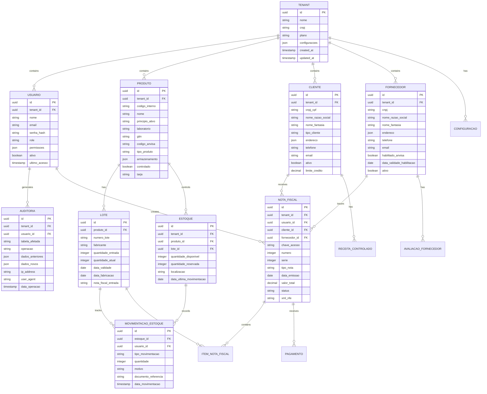

## 1. Arquitetura do Sistema


## 2. Descrição das Tecnologias

### Frontend

* **React 18** com TypeScript para type safety

* **Vite** como build tool para desenvolvimento rápido

* **Tailwind CSS 3** para estilização responsiva

* **React Query** para gerenciamento de estado do servidor

* **React Hook Form** para formulários complexos

* **Recharts** para visualização de dados e dashboards

* **React Router v6** para navegação

* **React Table** para tabelas avançadas com filtros

### Backend Services (Node.js)

* **Express.js 4** para APIs RESTful

* **TypeScript** para desenvolvimento type-safe

* **Bull Queue** para processamento assíncrono de jobs

* **Winston** para logging estruturado

* **Joi** para validação de schemas

* **PDFKit** para geração de relatórios PDF

* **xml2js** para parsing de XML fiscais

### Supabase Platform

* **PostgreSQL 15** como banco de dados principal

* **Row Level Security (RLS)** para controle de acesso granular

* **Supabase Auth** para autenticação multi-tenant

* **Supabase Storage** para documentos e anexos

* **Supabase Realtime** para atualizações em tempo real

* **Supabase Edge Functions** para webhooks e automações

### Integrações e Serviços Externos

* **Axios** para consumo de APIs externas

* **node-cron** para agendamento de tarefas

* **nodemailer** para envio de emails transacionais

* **socket.io** para notificações real-time

* **sharp** para processamento de imagens

## 3. Definições de Rotas

### Rotas Frontend (React Router)

| Rota                 | Propósito                                    |
| -------------------- | -------------------------------------------- |
| /                    | Dashboard principal com KPIs e alertas       |
| /login               | Página de autenticação com seleção de tenant |
| /estoque             | Gestão de estoque com tabela de produtos     |
| /estoque/produto/:id | Detalhes do produto e lotes                  |
| /compras             | Notas fiscais de entrada                     |
| /vendas              | Pedidos de vendas e notas de saída           |
| /clientes            | Cadastro e gestão de clientes                |
| /fornecedores        | Cadastro e gestão de fornecedores            |
| /controlados         | Gestão especial de medicamentos controlados  |
| /rastreabilidade     | Tracking de lotes e relatórios               |
| /auditoria           | Logs e relatórios de auditoria               |
| /relatorios          | Emissão de relatórios regulatórios           |
| /configuracoes       | Configurações do sistema e tenant            |
| /usuarios            | Gestão de usuários e permissões              |
| /documentos          | Central de documentos e anexos               |

### Rotas API Backend

| Rota                             | Propósito                            |
| -------------------------------- | ------------------------------------ |
| POST /api/auth/login             | Autenticação com validação de tenant |
| POST /api/auth/refresh           | Renovação de token JWT               |
| GET /api/tenant/:id/config       | Configurações específicas do tenant  |
| POST /api/produtos               | CRUD de produtos                     |
| GET /api/estoque/lote/:lote      | Rastreabilidade completa do lote     |
| POST /api/notas-fiscais/entrada  | Processamento de NF-e entrada        |
| POST /api/notas-fiscais/saida    | Emissão de NF-e saída                |
| POST /api/vendas                 | Criação de pedidos de venda          |
| GET /api/anvisa/sngpc/enviar     | Envio de movimento ao SNGPC          |
| GET /api/anvisa/sncm/consultar   | Consulta de lotes no SNCM            |
| POST /api/auditoria/exportar     | Exportação de logs de auditoria      |
| GET /api/relatorios/anvisa/:tipo | Geração de relatórios regulatórios   |
| POST /api/webhooks/anvisa        | Recebimento de webhooks da ANVISA    |
| POST /api/webhooks/sefaz         | Atualizações de status NF-e          |

## 4. Definições de APIs

### 4.1 Autenticação e Autorização

**POST /api/auth/login**

```typescript
// Request
interface LoginRequest {
  email: string;
  password: string;
  tenantId: string;
}

// Response
interface LoginResponse {
  accessToken: string;
  refreshToken: string;
  user: {
    id: string;
    email: string;
    name: string;
    role: UserRole;
    permissions: Permission[];
  };
  tenant: {
    id: string;
    name: string;
    plan: SubscriptionPlan;
    features: Feature[];
  };
}
```

### 4.2 Gestão de Produtos e Estoque

**POST /api/produtos**

```typescript
// Request
interface CreateProductRequest {
  nome: string;
  principioAtivo: string;
  laboratorio: string;
  codigoGtin: string;
  codigoAnvisa: string;
  classeTerapeutica: string;
  tipoProduto: 'COMUM' | 'CONTROLADO' | 'ANTIBIOTICO' | 'PSICOTROPICO';
  armazenamento: {
    temperaturaMin: number;
    temperaturaMax: number;
    umidadeMin: number;
    umidadeMax: number;
    tipoArmazenamento: 'AMBiente' | 'REFRIGERADO' | 'CONGELADO';
  };
  validadeDias: number;
  controladoPortaria344: boolean;
  substanciaControlada?: string;
  tarja: 'SEM_TARJA' | 'VERMELHA' | 'AMARELA' | 'PRETA';
}

// Response
interface ProductResponse {
  id: string;
  codigoInterno: string;
  ...CreateProductRequest;
  createdAt: string;
  updatedAt: string;
  ativo: boolean;
}
```

**GET /api/estoque/lote/:lote**

```typescript
// Response
interface LoteTraceabilityResponse {
  lote: string;
  produto: ProductResponse;
  quantidadeEntrada: number;
  quantidadeAtual: number;
  validade: string;
  fornecedor: SupplierInfo;
  movimentacoes: MovimentacaoEstoque[];
  rastreabilidadeCompleta: {
    entrada: NotaFiscalEntrada;
    saidas: NotaFiscalSaida[];
    devolucoes: Devolucao[];
    transferencias: Transferencia[];
  };
}
```

### 4.3 Notas Fiscais Eletrônicas

**POST /api/notas-fiscais/saida**

```typescript
// Request
interface EmitirNFeRequest {
  clienteId: string;
  naturezaOperacao: string;
  items: {
    produtoId: string;
    quantidade: number;
    lote: string;
    valorUnitario: number;
    desconto?: number;
  }[];
  formaPagamento: 'AVISTA' | 'APRAZO' | 'OUTROS';
  condicaoPagamento: string;
  transporte?: {
    transportadoraId?: string;
    modalidadeFrete: 'CIF' | 'FOB' | 'SEM_FRETE';
    volumes: number;
    pesoLiquido: number;
    pesoBruto: number;
  };
}

// Response
interface EmitirNFeResponse {
  nfeId: string;
  chaveAcesso: string;
  numero: number;
  serie: number;
  dataEmissao: string;
  xml: string;
  danfe: string; // URL do PDF
  protocolo?: string;
  status: 'EMITIDA' | 'AUTORIZADA' | 'CANCELADA' | 'DENEGADA';
}
```

### 4.4 Integração ANVISA

**POST /api/anvisa/sngpc/enviar**

```typescript
// Request
interface SNGPCRequest {
  periodoInicio: string;
  periodoFim: string;
  estabelecimento: {
    cnpj: string;
    crf: string;
    uf: string;
  };
  movimentacoes: {
    tipo: 'ENTRADA' | 'SAIDA';
    produto: string;
    lote: string;
    quantidade: number;
    numeroNota: string;
    dataNota: string;
    receita?: {
      numero: string;
      data: string;
      medico: string;
      crm: string;
      ufCRM: string;
    };
  }[];
}

// Response
interface SNGPCResponse {
  protocolo: string;
  dataEnvio: string;
  status: 'SUCESSO' | 'ERRO' | 'VALIDACAO';
  mensagens?: string[];
}
```

## 5. Arquitetura do Servidor


## 6. Modelo de Dados

### 6.1 Diagrama ER Principal



### 6.2 Definições DDL (Data Definition Language)

```sql
-- Tabela de Tenants (isolamento multi-tenant)
CREATE TABLE tenants (
    id UUID PRIMARY KEY DEFAULT gen_random_uuid(),
    nome VARCHAR(255) NOT NULL,
    cnpj VARCHAR(14) UNIQUE NOT NULL,
    plano VARCHAR(50) NOT NULL DEFAULT 'starter',
    configuracoes JSONB DEFAULT '{}',
    data_criacao TIMESTAMP WITH TIME ZONE DEFAULT NOW(),
    data_atualizacao TIMESTAMP WITH TIME ZONE DEFAULT NOW(),
    ativo BOOLEAN DEFAULT true
);

-- Índices para tenants
CREATE INDEX idx_tenants_cnpj ON tenants(cnpj);
CREATE INDEX idx_tenants_plano ON tenants(plano);

-- Tabela de Usuários com RLS
CREATE TABLE usuarios (
    id UUID PRIMARY KEY DEFAULT gen_random_uuid(),
    tenant_id UUID NOT NULL REFERENCES tenants(id) ON DELETE CASCADE,
    nome VARCHAR(255) NOT NULL,
    email VARCHAR(255) NOT NULL,
    senha_hash VARCHAR(255) NOT NULL,
    role VARCHAR(50) NOT NULL,
    permissoes JSONB DEFAULT '[]',
    ativo BOOLEAN DEFAULT true,
    ultimo_acesso TIMESTAMP WITH TIME ZONE,
    criado_em TIMESTAMP WITH TIME ZONE DEFAULT NOW(),
    atualizado_em TIMESTAMP WITH TIME ZONE DEFAULT NOW(),
    UNIQUE(tenant_id, email)
);

-- RLS para usuários
ALTER TABLE usuarios ENABLE ROW LEVEL SECURITY;
CREATE POLICY usuarios_isolation ON usuarios FOR ALL TO authenticated 
    USING (tenant_id = current_setting('app.current_tenant')::UUID);

-- Índices para usuários
CREATE INDEX idx_usuarios_tenant_email ON usuarios(tenant_id, email);
CREATE INDEX idx_usuarios_role ON usuarios(role);

-- Tabela de Produtos
CREATE TABLE produtos (
    id UUID PRIMARY KEY DEFAULT gen_random_uuid(),
    tenant_id UUID NOT NULL REFERENCES tenants(id) ON DELETE CASCADE,
    codigo_interno VARCHAR(50) NOT NULL,
    nome VARCHAR(500) NOT NULL,
    principio_ativo VARCHAR(500),
    laboratorio VARCHAR(255),
    gtin VARCHAR(14),
    codigo_anvisa VARCHAR(50),
    tipo_produto VARCHAR(50) NOT NULL,
    armazenamento JSONB DEFAULT '{}',
    controlado BOOLEAN DEFAULT false,
    substancia_controlada VARCHAR(255),
    tarja VARCHAR(50) DEFAULT 'SEM_TARJA',
    ativo BOOLEAN DEFAULT true,
    criado_em TIMESTAMP WITH TIME ZONE DEFAULT NOW(),
    atualizado_em TIMESTAMP WITH TIME ZONE DEFAULT NOW(),
    UNIQUE(tenant_id, codigo_interno)
);

-- RLS para produtos
ALTER TABLE produtos ENABLE ROW LEVEL SECURITY;
CREATE POLICY produtos_isolation ON produtos FOR ALL TO authenticated 
    USING (tenant_id = current_setting('app.current_tenant')::UUID);

-- Índices para produtos
CREATE INDEX idx_produtos_tenant_codigo ON produtos(tenant_id, codigo_interno);
CREATE INDEX idx_produtos_gtin ON produtos(gtin);
CREATE INDEX idx_produtos_controlado ON produtos(controlado);

-- Tabela de Lotes (rastreabilidade)
CREATE TABLE lotes (
    id UUID PRIMARY KEY DEFAULT gen_random_uuid(),
    tenant_id UUID NOT NULL REFERENCES tenants(id) ON DELETE CASCADE,
    produto_id UUID NOT NULL REFERENCES produtos(id) ON DELETE CASCADE,
    numero_lote VARCHAR(100) NOT NULL,
    fabricante VARCHAR(255),
    quantidade_entrada INTEGER NOT NULL,
    quantidade_atual INTEGER NOT NULL,
    data_validade DATE NOT NULL,
    data_fabricacao DATE,
    nota_fiscal_entrada VARCHAR(50),
    criado_em TIMESTAMP WITH TIME ZONE DEFAULT NOW(),
    UNIQUE(tenant_id, produto_id, numero_lote)
);

-- RLS para lotes
ALTER TABLE lotes ENABLE ROW LEVEL SECURITY;
CREATE POLICY lotes_isolation ON lotes FOR ALL TO authenticated 
    USING (tenant_id = current_setting('app.current_tenant')::UUID);

-- Índices para lotes
CREATE INDEX idx_lotes_tenant_produto ON lotes(tenant_id, produto_id);
CREATE INDEX idx_lotes_validade ON lotes(data_validade);
CREATE INDEX idx_lotes_numero ON lotes(numero_lote);

-- Tabela de Estoque (controle de saldo)
CREATE TABLE estoque (
    id UUID PRIMARY KEY DEFAULT gen_random_uuid(),
    tenant_id UUID NOT NULL REFERENCES tenants(id) ON DELETE CASCADE,
    produto_id UUID NOT NULL REFERENCES produtos(id) ON DELETE CASCADE,
    lote_id UUID NOT NULL REFERENCES lotes(id) ON DELETE CASCADE,
    quantidade_disponivel INTEGER NOT NULL DEFAULT 0,
    quantidade_reservada INTEGER NOT NULL DEFAULT 0,
    localizacao VARCHAR(100),
    data_ultima_movimentacao TIMESTAMP WITH TIME ZONE,
    criado_em TIMESTAMP WITH TIME ZONE DEFAULT NOW(),
    atualizado_em TIMESTAMP WITH TIME ZONE DEFAULT NOW(),
    UNIQUE(tenant_id, produto_id, lote_id)
);

-- RLS para estoque
ALTER TABLE estoque ENABLE ROW LEVEL SECURITY;
CREATE POLICY estoque_isolation ON estoque FOR ALL TO authenticated 
    USING (tenant_id = current_setting('app.current_tenant')::UUID);

-- Índices para estoque
CREATE INDEX idx_estoque_tenant_produto ON estoque(tenant_id, produto_id);
CREATE INDEX idx_estoque_lote ON estoque(lote_id);
CREATE INDEX idx_estoque_localizacao ON estoque(localizacao);

-- Tabela de Movimentações de Estoque (auditoria)
CREATE TABLE movimentacoes_estoque (
    id UUID PRIMARY KEY DEFAULT gen_random_uuid(),
    tenant_id UUID NOT NULL REFERENCES tenants(id) ON DELETE CASCADE,
    estoque_id UUID NOT NULL REFERENCES estoque(id) ON DELETE CASCADE,
    usuario_id UUID NOT NULL REFERENCES usuarios(id) ON DELETE CASCADE,
    tipo_movimentacao VARCHAR(50) NOT NULL,
    quantidade INTEGER NOT NULL,
    saldo_anterior INTEGER NOT NULL,
    saldo_novo INTEGER NOT NULL,
    motivo VARCHAR(500),
    documento_referencia VARCHAR(100),
    data_movimentacao TIMESTAMP WITH TIME ZONE DEFAULT NOW()
);

-- RLS para movimentações
ALTER TABLE movimentacoes_estoque ENABLE ROW LEVEL SECURITY;
CREATE POLICY mov_estoque_isolation ON movimentacoes_estoque FOR ALL TO authenticated 
    USING (tenant_id = current_setting('app.current_tenant')::UUID);

-- Índices para movimentações
CREATE INDEX idx_mov_estoque_tenant ON movimentacoes_estoque(tenant_id);
CREATE INDEX idx_mov_estoque_estoque ON movimentacoes_estoque(estoque_id);
CREATE INDEX idx_mov_estoque_data ON movimentacoes_estoque(data_movimentacao);
CREATE INDEX idx_mov_estoque_tipo ON movimentacoes_estoque(tipo_movimentacao);

-- Tabela de Notas Fiscais
CREATE TABLE notas_fiscais (
    id UUID PRIMARY KEY DEFAULT gen_random_uuid(),
    tenant_id UUID NOT NULL REFERENCES tenants(id) ON DELETE CASCADE,
    usuario_id UUID NOT NULL REFERENCES usuarios(id) ON DELETE CASCADE,
    cliente_id UUID REFERENCES clientes(id) ON DELETE SET NULL,
    fornecedor_id UUID REFERENCES fornecedores(id) ON DELETE SET NULL,
    chave_acesso VARCHAR(44) UNIQUE,
    numero INTEGER NOT NULL,
    serie INTEGER NOT NULL,
    tipo_nota VARCHAR(50) NOT NULL, -- ENTRADA, SAIDA, DEVOLUCAO
    data_emissao TIMESTAMP WITH TIME ZONE NOT NULL,
    valor_total DECIMAL(15,2) NOT NULL,
    status VARCHAR(50) NOT NULL,
    xml_nfe TEXT,
    protocolo VARCHAR(50),
    data_autorizacao TIMESTAMP WITH TIME ZONE,
    criado_em TIMESTAMP WITH TIME ZONE DEFAULT NOW(),
    atualizado_em TIMESTAMP WITH TIME ZONE DEFAULT NOW(),
    UNIQUE(tenant_id, numero, serie, tipo_nota)
);

-- RLS para notas fiscais
ALTER TABLE notas_fiscais ENABLE ROW LEVEL SECURITY;
CREATE POLICY nf_isolation ON notas_fiscais FOR ALL TO authenticated 
    USING (tenant_id = current_setting('app.current_tenant')::UUID);

-- Índices para notas fiscais
CREATE INDEX idx_nf_tenant_tipo ON notas_fiscais(tenant_id, tipo_nota);
CREATE INDEX idx_nf_chave ON notas_fiscais(chave_acesso);
CREATE INDEX idx_nf_data ON notas_fiscais(data_emissao);
CREATE INDEX idx_nf_status ON notas_fiscais(status);

-- Tabela de Itens da Nota Fiscal
CREATE TABLE itens_nota_fiscal (
    id UUID PRIMARY KEY DEFAULT gen_random_uuid(),
    tenant_id UUID NOT NULL REFERENCES tenants(id) ON DELETE CASCADE,
    nota_fiscal_id UUID NOT NULL REFERENCES notas_fiscais(id) ON DELETE CASCADE,
    produto_id UUID NOT NULL REFERENCES produtos(id) ON DELETE CASCADE,
    lote_id UUID NOT NULL REFERENCES lotes(id) ON DELETE CASCADE,
    quantidade INTEGER NOT NULL,
    valor_unitario DECIMAL(15,2) NOT NULL,
    valor_total DECIMAL(15,2) NOT NULL,
    desconto DECIMAL(15,2) DEFAULT 0,
    cfop VARCHAR(10) NOT NULL,
    ncm VARCHAR(10),
    cst_icms VARCHAR(5),
    aliquota_icms DECIMAL(5,2),
    criado_em TIMESTAMP WITH TIME ZONE DEFAULT NOW()
);

-- RLS para itens NF
ALTER TABLE itens_nota_fiscal ENABLE ROW LEVEL SECURITY;
CREATE POLICY itens_nf_isolation ON itens_nota_fiscal FOR ALL TO authenticated 
    USING (tenant_id = current_setting('app.current_tenant')::UUID);

-- Índices para itens NF
CREATE INDEX idx_itens_nf_nota ON itens_nota_fiscal(nota_fiscal_id);
CREATE INDEX idx_itens_nf_produto ON itens_nota_fiscal(produto_id);
CREATE INDEX idx_itens_nf_lote ON itens_nota_fiscal(lote_id);

-- Tabela de Auditoria (WORM - Write Once Read Many)
CREATE TABLE auditoria (
    id UUID PRIMARY KEY DEFAULT gen_random_uuid(),
    tenant_id UUID NOT NULL REFERENCES tenants(id) ON DELETE CASCADE,
    usuario_id UUID NOT NULL REFERENCES usuarios(id) ON DELETE CASCADE,
    tabela_afetada VARCHAR(100) NOT NULL,
    registro_id UUID NOT NULL,
    operacao VARCHAR(20) NOT NULL, -- INSERT, UPDATE, DELETE
    dados_anteriores JSONB,
    dados_novos JSONB,
    ip_address INET,
    user_agent TEXT,
    data_operacao TIMESTAMP WITH TIME ZONE DEFAULT NOW()
) WITH (fillfactor=100); -- Otimizado para leitura

-- RLS para auditoria (apenas leitura para todos)
ALTER TABLE auditoria ENABLE ROW LEVEL SECURITY;
CREATE POLICY auditoria_read ON auditoria FOR SELECT TO authenticated 
    USING (tenant_id = current_setting('app.current_tenant')::UUID);

-- Índices para auditoria
CREATE INDEX idx_auditoria_tenant_tabela ON auditoria(tenant_id, tabela_afetada);
CREATE INDEX idx_auditoria_operacao ON auditoria(operacao);
CREATE INDEX idx_auditoria_data ON auditoria(data_operacao);
CREATE INDEX idx_auditoria_registro ON auditoria(tabela_afetada, registro_id);

-- Tabela de Configurações por Tenant
CREATE TABLE configuracoes (
    id UUID PRIMARY KEY DEFAULT gen_random_uuid(),
    tenant_id UUID NOT NULL REFERENCES tenants(id) ON DELETE CASCADE,
    chave VARCHAR(100) NOT NULL,
    valor JSONB NOT NULL,
    categoria VARCHAR(50) NOT NULL,
    descricao TEXT,
    criado_em TIMESTAMP WITH TIME ZONE DEFAULT NOW(),
    atualizado_em TIMESTAMP WITH TIME ZONE DEFAULT NOW(),
    UNIQUE(tenant_id, chave)
);

-- RLS para configurações
ALTER TABLE configuracoes ENABLE ROW LEVEL SECURITY;
CREATE POLICY config_isolation ON configuracoes FOR ALL TO authenticated 
    USING (tenant_id = current_setting('app.current_tenant')::UUID);

-- Função para atualizar timestamps
CREATE OR REPLACE FUNCTION update_updated_at_column()
RETURNS TRIGGER AS $$
BEGIN
    NEW.atualizado_em = NOW();
    RETURN NEW;
END;
$$ language 'plpgsql';

-- Triggers para atualizar updated_at
CREATE TRIGGER update_tenants_updated_at BEFORE UPDATE ON tenants
    FOR EACH ROW EXECUTE FUNCTION update_updated_at_column();

CREATE TRIGGER update_usuarios_updated_at BEFORE UPDATE ON usuarios
    FOR EACH ROW EXECUTE FUNCTION update_updated_at_column();

CREATE TRIGGER update_produtos_updated_at BEFORE UPDATE ON produtos
    FOR EACH ROW EXECUTE FUNCTION update_updated_at_column();

CREATE TRIGGER update_estoque_updated_at BEFORE UPDATE ON estoque
    FOR EACH ROW EXECUTE FUNCTION update_updated_at_column();

CREATE TRIGGER update_notas_fiscais_updated_at BEFORE UPDATE ON notas_fiscais
    FOR EACH ROW EXECUTE FUNCTION update_updated_at_column();

-- Permissões básicas para anon e authenticated
GRANT SELECT ON ALL TABLES TO anon;
GRANT ALL PRIVILEGES ON ALL TABLES TO authenticated;
GRANT ALL PRIVILEGES ON ALL SEQUENCES TO authenticated;

-- Permissões específicas para auditoria (apenas SELECT)
REVOKE ALL ON auditoria FROM authenticated;
GRANT SELECT ON auditoria TO authenticated;
```

## 7. Segurança e Compliance

### 7.1 Criptografia

* **Dados em repouso**: AES-256 para dados sensíveis no banco

* **Dados em trânsito**: TLS 1.3 para todas as comunicações

* **Chaves de API**: RSA-2048 para integrações com governo

* **Senhas**: bcrypt com salt rounds = 12

### 7.2 Controle de Acesso

* **RBAC (Role-Based Access Control)**: Permissões por papel

* **ABAC (Attribute-Based Access Control)**: Considerando tenant, horário, IP

* **MFA (Multi-Factor Authentication)**: Obrigatório para administradores

* **Session Management**: JWT com refresh tokens, expiração configurável

### 7.3 Conformidade Regulatória

* **LGPD**: Consentimento, direito ao esquecimento, portabilidade

* **RDC 430**: Rastreabilidade completa, controle de validade

* **Guia 33**: Controle especial de medicamentos controlados

* **SPED Fiscal**: Integração com sistema fiscal brasileiro

### 7.4 Auditoria e Logs

* **Audit Trail**: Imutável com hash chain para integridade

* **Log Retention**: 7 anos para obrigações fiscais

* **Log Protection**: Criptografia e controle de acesso

* **Tamper Detection**: Verificação periódica de integridade

## 8. Performance e Escalabilidade

### 8.1 Otimizações de Banco de Dados

* **Partitioning**: Tabelas grandes particionadas por tenant e data

* **Indexes**: Índices otimizados para queries frequentes

* **Materialized Views**: Relatórios complexos pré-calculados

* **Connection Pooling**: PgBouncer para otimização de conexões

### 8.2 Cache e CDN

* **Redis**: Cache de sessões e dados frequentes

* **CloudFlare**: CDN para assets estáticos

* **Browser Cache**: Headers otimizados para recursos estáticos

* **Service Worker**: Cache offline para funcionalidades críticas

### 8.3 Monitoramento

* **New Relic**: APM para monitoramento de performance

* **Prometheus + Grafana**: Métricas e dashboards

* **Sentry**: Error tracking e performance monitoring

* **Uptime Robot**: Monitoramento de disponibilidade externa

## 9. Deployment e DevOps

### 9.1 Infraestrutura

* **Cloud Provider**: AWS (us-east-1) com multi-AZ

* **Containers**: Docker com Kubernetes (EKS)

* **Database**: Supabase (PostgreSQL gerenciado)

* **Storage**: S3 para documentos e backups

### 9.2 CI/CD Pipeline

* **GitHub Actions**: Build, test e deploy automatizado

* **Staging Environment**: Ambiente de homologação por tenant

* **Blue-Green Deployment**: Zero downtime deployments

* **Rollback Automático**: Em caso de falhas de health check

### 9.3 Backup e Disaster Recovery

* **Backup Automático**: Diário com retenção de 30 dias

* **Cross-region Replication**: Backup em região secundária

* **Point-in-time Recovery**: Capacidade de restore para qualquer momento

* **Disaster Recovery Test**: Testes mensais de recuperação

## 10. Integrações e APIs Externas

### 10.1 ANVISA APIs

* **SNGPC**: Envio diário de movimentação de controlados

* **SNCM**: Rastreabilidade nacional de medicamentos

* **Validação de Receitas**: Integração com sistemas estaduais

* **Consulta de Habilitação**: Verificação de fornecedores

### 10.2 Sefaz e Fiscal

* **NF-e**: Emissão e consulta de status via webservice

* **CT-e**: Conhecimento de transporte eletrônico

* **MDF-e**: Manifesto de documentos fiscais

* **SPED**: Geração de arquivos fiscais

### 10.3 Serviços Auxiliares

* **Correios**: Rastreamento de encomendas

* **Pagamento**: Integração com gateways (PagSeguro, MercadoPago)

* **Email**: SendGrid para emails transacionais

* **SMS**: Twilio para notificações críticas

