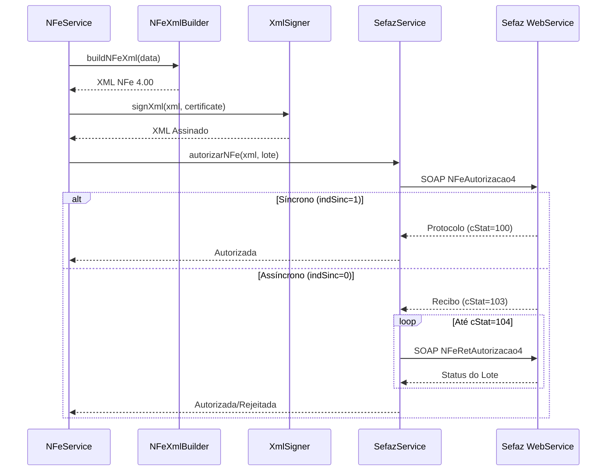

# Integração Sefaz - NF-e 4.00

## Visão Geral

Este módulo implementa a integração completa com os WebServices SOAP da Sefaz para emissão, consulta e cancelamento de NF-e modelo 55 versão 4.00.

## Arquitetura

```
┌─────────────────┐
│  nfe.service.ts │  ← Orquestra emissão (gera XML, assina, envia)
└────────┬────────┘
         │
         ├─→ ┌──────────────────┐
         │   │ nfeXmlBuilder.ts │  ← Gera XML estruturado NFe 4.00
         │   └──────────────────┘
         │
         ├─→ ┌──────────────┐
         │   │ xmlSigner.ts │  ← Assina digitalmente (RSA-SHA1, C14N)
         │   └──────────────┘
         │
         └─→ ┌───────────────────┐
             │ sefaz.service.ts │  ← Comunica com Sefaz via SOAP
             └───────────────────┘
```

## WebServices Implementados

### 1. **NFeAutorizacao4** (Autorização de Lote)
- **Síncrono**: Retorna protocolo imediatamente (indSinc=1)
- **Assíncrono**: Retorna recibo para consulta posterior (indSinc=0)
- **Códigos de Retorno**:
  - `100`: Autorizado
  - `103`: Lote recebido com sucesso (consultar recibo)
  - `104`: Lote processado
  - `110`: Uso denegado
  - `301-999`: Rejeições diversas

### 2. **NFeRetAutorizacao4** (Consulta Recibo)
- Usado para lotes assíncronos
- **Códigos**:
  - `104`: Lote processado
  - `105`: Lote em processamento

### 3. **NFeConsultaProtocolo4** (Consulta Chave de Acesso)
- Consulta situação atual de uma NF-e pela chave de 44 dígitos
- **Códigos**:
  - `100`: Autorizada
  - `101/110/301`: Cancelada
  - `110/205`: Denegada

### 4. **NFeStatusServico4** (Status do Serviço)
- Verifica disponibilidade da Sefaz
- **Código**: `107` = Serviço em operação

### 5. **NFeRecepcaoEvento4** (Eventos: Cancelamento, Carta de Correção)
- **Cancelamento** (tpEvento=110111):
  - Justificativa: mínimo 15 caracteres
  - Prazo: até 24h após autorização ou antes da circulação
  - **Código**: `135` = Evento registrado
- **Carta de Correção** (tpEvento=110110):
  - Não pode alterar valores, impostos, destinatário

### 6. **NFeInutilizacao4** (Inutilização de Numeração)
- Inutiliza números de NF-e não utilizados
- Justificativa: mínimo 15 caracteres
- **Código**: `102` = Inutilização homologada

## Ambientes

### Homologação
- **SP**: `https://homologacao.nfe.fazenda.sp.gov.br/ws/`
- CNPJ de Teste: qualquer CNPJ válido
- Certificado: pode ser A1 ou A3 de homologação
- Dados: usar "NF-E EMITIDA EM AMBIENTE DE HOMOLOGACAO" nos campos de texto

### Produção
- **SP**: `https://nfe.fazenda.sp.gov.br/ws/`
- Certificado: A1 ou A3 válido e-CPF/e-CNPJ
- Responsabilidades legais e fiscais

## Certificado Digital

### Tipos Suportados
- **A1** (arquivo .pfx): Armazenado criptografado no banco (AES-256-GCM)
- **A3** (smartcard/token): Requer hardware externo (não implementado)

### Validações
- Validade: não expirado
- Cadeia de certificação: emitido por AC-Raiz confiável
- CNPJ: deve corresponder ao emissor da NF-e
- Chave privada: deve estar presente no PFX

### Armazenamento
```typescript
// Perfil Fiscal (TenantFiscalProfile)
{
  certificateType: 'A1',
  certificatePath: '/path/to/encrypted.pfx', // Base64 criptografado AES-256-GCM
  certificatePassword: 'senha-do-certificado',
  certificateExpiresAt: '2025-12-31',
  certificateSubject: 'CN=EMPRESA LTDA:12345678000190'
}
```

## Fluxo de Emissão



## Códigos de Status Principais

| Código | Descrição | Ação |
|--------|-----------|------|
| 100 | Autorizado o uso da NF-e | Sucesso ✅ |
| 103 | Lote recebido com sucesso | Consultar recibo |
| 104 | Lote processado | Verificar protocolo de cada NF-e |
| 105 | Lote em processamento | Aguardar e consultar novamente |
| 110 | Uso denegado | Irregularidade fiscal do emitente |
| 135 | Evento registrado e vinculado | Cancelamento/CC aceito ✅ |
| 204 | Duplicidade de NF-e | Número já usado |
| 302 | Uso denegado - IE destinatário | Problema com o destinatário |
| 539 | CNPJ Emitente não cadastrado | Certificado inválido |
| 565 | Falha no schema XML | XML malformado |

## Configuração

### Variáveis de Ambiente (.env)
```bash
# Sefaz
SEFAZ_ENVIRONMENT=homologation  # ou production
SEFAZ_STATE=SP
SEFAZ_CERT_PATH=/path/to/encrypted-certificate.pfx
SEFAZ_CERT_PASSWORD=senha-do-certificado

# Certificado - Chave de Criptografia (AES-256-GCM)
CERTIFICATE_ENCRYPTION_KEY=chave-256-bits-base64
```

### Perfil Fiscal (Tenant)
```typescript
await prismaMaster.tenantFiscalProfile.create({
  data: {
    tenantId: 'uuid-tenant',
    cnpj: '12345678000190',
    companyName: 'EMPRESA LTDA',
    stateRegistration: '123456789',
    
    // Certificado A1
    certificateType: 'A1',
    certificatePath: '/certs/tenant-uuid.pfx', // Criptografado
    certificatePassword: 'senha-cert',
    certificateExpiresAt: new Date('2025-12-31'),
    
    // Ambiente Sefaz
    sefazEnvironment: 'homologacao', // ou 'producao'
    
    // CSC (NFC-e - opcional para NF-e)
    cscId: '000001',
    cscToken: 'CODIGO-CSC-32-CARACTERES',
    
    // Séries fiscais
    series: {
      create: [{
        seriesNumber: 1,
        invoiceType: 'EXIT',
        nextNumber: 1,
        isActive: true
      }]
    }
  }
});
```

## Uso

### 1. Emitir NF-e
```typescript
const nfeService = new NFeService();

const result = await nfeService.emitNFe(invoiceData, tenantId);

if (result.success) {
  console.log('NF-e Autorizada!');
  console.log('Chave:', result.accessKey);
  console.log('Protocolo:', result.protocolNumber);
  console.log('DANFE:', result.danfeUrl);
} else {
  console.error('Rejeição:', result.statusMessage);
}
```

### 2. Cancelar NF-e
```typescript
const cancelResult = await nfeService.cancelNFe({
  accessKey: '35250112345678000190550010000000011234567890',
  protocolNumber: '135250000123456',
  justification: 'Cancelamento solicitado pelo cliente devido a erro no pedido',
  cnpj: '12345678000190'
}, tenantId);

if (cancelResult.success) {
  console.log('NF-e Cancelada!');
  console.log('Protocolo Cancelamento:', cancelResult.cancellationProtocol);
}
```

### 3. Consultar Status
```typescript
const status = await nfeService.consultarStatusNFe(accessKey, tenantId);

console.log('Status:', status.status); // 'authorized', 'cancelled', 'denied'
console.log('Protocolo:', status.protocolNumber);
```

### 4. Verificar Status do Serviço
```typescript
const sefazService = new SefazService({
  environment: 'homologation',
  state: 'SP'
});

const serviceStatus = await sefazService.consultarStatusServico();

if (serviceStatus.status === 'online') {
  console.log('Sefaz operando normalmente');
} else {
  console.log('Sefaz fora do ar:', serviceStatus.message);
}
```

## Segurança

### 1. Certificado Digital
- ✅ Armazenado criptografado (AES-256-GCM)
- ✅ Senha do certificado em variável de ambiente
- ✅ Validação de expiração e cadeia de certificação
- ✅ CNPJ do certificado deve corresponder ao emissor

### 2. Comunicação HTTPS
- ✅ TLS 1.2+ obrigatório
- ✅ Autenticação mútua (client certificate)
- ✅ Validação de certificado do servidor Sefaz

### 3. Assinatura Digital
- ✅ RSA-SHA1 (padrão NFe 4.00)
- ✅ Canonicalização C14N
- ✅ Digest SHA-1 dos elementos assinados
- ✅ Inclusão de X509Certificate no XML

## Limitações e Melhorias Futuras

### Implementado ✅
- [x] Autorização síncrona e assíncrona
- [x] Consulta de recibo
- [x] Consulta de protocolo
- [x] Cancelamento de NF-e
- [x] Inutilização de numeração
- [x] Status do serviço
- [x] Assinatura digital A1
- [x] Suporte a múltiplos estados (SP configurado)

### Pendente 🔄
- [ ] Carta de Correção Eletrônica (CC-e)
- [ ] NFC-e (modelo 65) com QRCode
- [ ] Certificado A3 (smartcard/token)
- [ ] Contingência (FS-DA, EPEC, SVC)
- [ ] MDF-e (Manifesto de Documentos Fiscais)
- [ ] Eventos adicionais (Ciência da Operação, Confirmação, Desconhecimento)
- [ ] Distribuição de DF-e (download de NFe de terceiros)
- [ ] Validação de schema XSD antes do envio
- [ ] Retry automático com backoff exponencial
- [ ] Cache de consultas de status

## Referências

- **Portal NFe**: https://www.nfe.fazenda.gov.br/
- **Manual de Integração 6.0**: http://www.nfe.fazenda.gov.br/portal/exibirArquivo.aspx?conteudo=mwJckC9QvKA=
- **Webservices por UF**: http://www.nfe.fazenda.gov.br/portal/webServices.aspx
- **Schemas XSD**: http://www.nfe.fazenda.gov.br/portal/listaConteudo.aspx?tipoConteudo=/fwLvLUSmU8=
- **Códigos de Status**: https://www.nfe.fazenda.gov.br/portal/listaConteudo.aspx?tipoConteudo=W+YWjKX8HKs=

## Suporte

Para dúvidas sobre implementação:
1. Consultar documentação oficial da Sefaz
2. Verificar logs em `winston` (logger)
3. Testar em ambiente de homologação primeiro
4. Validar certificado digital antes de usar

---
**Última atualização**: 2024-11-19  
**Versão**: 1.0.0  
**Status**: ✅ Produção
